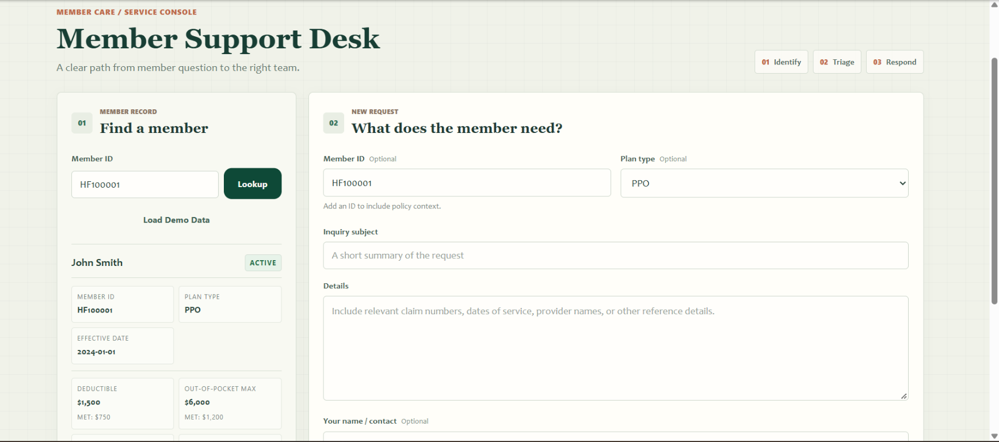
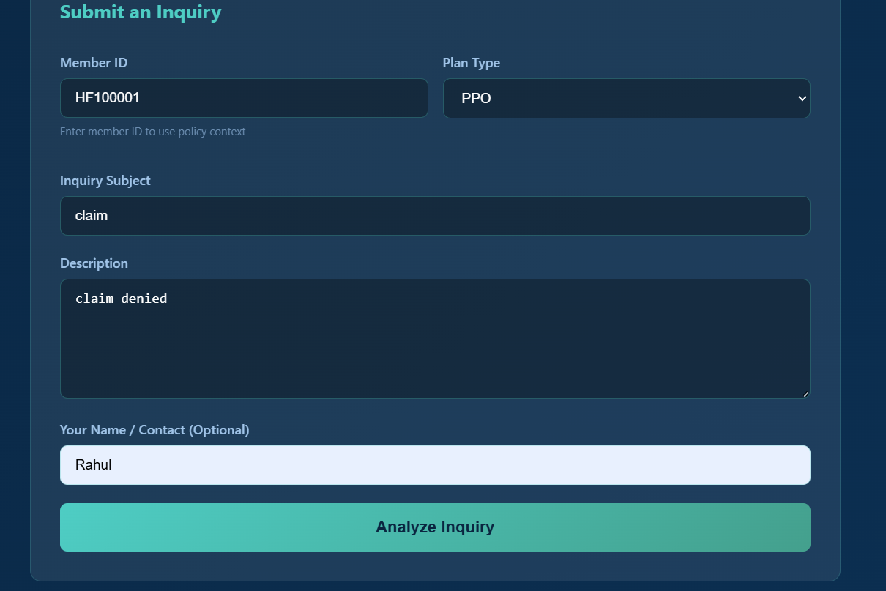
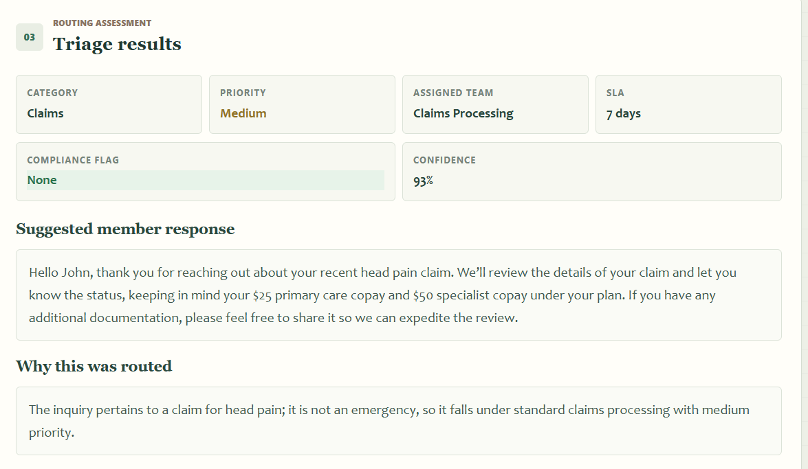
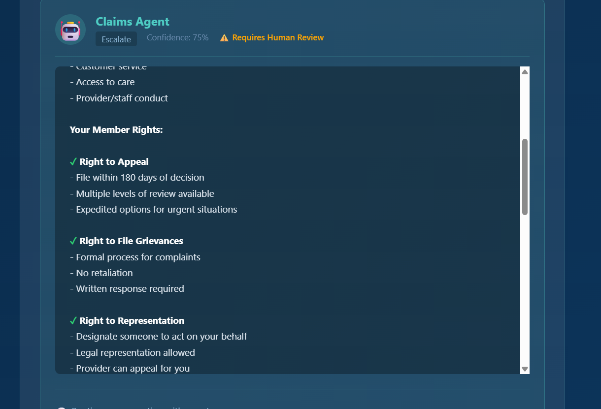

# Aster Health Member Triage

Aster Health is a demonstration member-support application for health-insurance inquiries. It combines a Groq-hosted large language model (LLM), LangChain, and retrieval-augmented generation (RAG) to provide inquiry triage with relevant insurance knowledge and optional member-policy context.

The app includes a browser-based support desk, a FastAPI backend, a local SQLite database, specialized inquiry agents, and follow-up chat.

> **Demonstration only:** This project is not a production health-insurance system and is not certified as HIPAA compliant. Do not enter real protected health information (PHI), API secrets, or other sensitive data.

## Screenshots

### Member lookup and support desk

*Look up a demo member and view policy details alongside the inquiry form.*

### Submit an inquiry

*Provide an inquiry and optional member context for triage.*

### LLM triage results

*Review the category, priority, assigned team, SLA, compliance flag, suggested response, and rationale.*

### Specialized agent response

*See a domain-specific response after the inquiry has been routed.*

## What the app does

- Accepts health-insurance inquiries through a browser-based support desk.
- Uses a Groq-hosted LLM to classify and prioritize inquiries, recommend a team and SLA, flag compliance considerations, and draft a response.
- Uses LangChain prompt templates and the `ChatGroq` integration to call the configured Groq model.
- Retrieves relevant snippets from a local insurance knowledge base and includes them in LLM prompts using RAG.
- Optionally looks up a member's policy details and inquiry history from SQLite to provide additional context.
- Routes the triaged inquiry through a specialized agent orchestrator.
- Saves inquiries and triage results locally, and supports follow-up chat with conversation history.

## Current AI and RAG workflow

1. The user optionally looks up a member and enters an inquiry.
2. The FastAPI backend loads matching policy and inquiry-history context from SQLite when a member ID is available.
3. The RAG service reads `backend/knowledge_base/insurance_knowledge.json`, builds a TF-IDF representation of its documents, and uses cosine similarity to retrieve up to three relevant snippets.
4. The backend combines retrieved knowledge with the inquiry and available member context.
5. LangChain sends the prompt to the configured Groq LLM. The current model setting is `openai/gpt-oss-120b`.
6. The LLM returns structured triage information. The backend validates and presents the category, priority, assigned team, compliance flag, suggested response, rationale, SLA, and confidence.
7. The agent orchestrator routes the inquiry to a specialized agent and returns its response; the inquiry and triage data are saved in SQLite.
8. For follow-up chat, LangChain sends the conversation history together with relevant RAG and member context to the Groq LLM.

**RAG implementation note:** Retrieval currently uses scikit-learn TF-IDF and cosine similarity over the local JSON knowledge base. It does not use a hosted vector database or embedding API.

## Specialized agents

| Agent | Typical inquiry areas |
|---|---|
| Claims | Claim status, denials, EOBs, and reimbursement |
| Prior Authorization | Authorization requirements, status, and urgent requests |
| Benefits | Coverage, cost sharing, network, and pharmacy questions |
| Billing | Payments, billing disputes, payment plans, and refunds |
| Member Services | ID cards, account updates, and general member support |
| Appeals & Grievances | Appeals, complaints, and cases needing human review |
| Wellness & Outreach | Preventive care and wellness programs |

The specialized routing agents and the Groq-powered LLM have distinct roles: the LLM creates the triage assessment and powers follow-up chat, while the orchestrator routes the inquiry through the registered domain agents.

## Technology

- **Backend:** Python, FastAPI, Pydantic, SQLAlchemy, aiosqlite
- **Frontend:** HTML, CSS, and vanilla JavaScript
- **LLM provider:** Groq API
- **LLM integration:** LangChain and `langchain-groq`
- **RAG retrieval:** scikit-learn TF-IDF and cosine similarity
- **Database:** SQLite

## Project structure

```text
.
├── backend/
│   ├── agents/                       # Specialized agent classes and orchestrator
│   ├── knowledge_base/
│   │   └── insurance_knowledge.json  # Local source documents used by RAG
│   ├── chat_service.py               # LangChain follow-up chat
│   ├── config.py                     # Loads backend/.env and selects Groq model
│   ├── database.py                   # SQLite models and async database setup
│   ├── db_service.py                 # Member and inquiry database operations
│   ├── grok_service.py               # LangChain/Groq inquiry triage call
│   ├── main.py                       # FastAPI application and API routes
│   ├── rag_service.py                # TF-IDF retrieval and RAG context building
│   ├── start_server.py               # Finds an available port and starts Uvicorn
│   ├── test_rag_service.py           # RAG retrieval tests
│   ├── triage_service.py             # Inquiry context, triage, routing, and persistence
│   └── requirements.txt
├── docs/
│   └── images/                       # README screenshots
├── frontend/
│   ├── app.js
│   ├── index.html
│   └── style.css
├── .env.example
├── .gitignore
├── run_app.bat                       # Windows launcher
└── README.md
```

## Requirements

- Python 3.10 or newer
- A Groq API key from the [Groq Console](https://console.groq.com/keys)

## Setup and run on Windows

Run these commands from PowerShell in the project folder:

1. Create and activate a virtual environment:

   ```powershell
   py -m venv .venv
   .\.venv\Scripts\Activate.ps1
   ```

2. Install the backend dependencies:

   ```powershell
   py -m pip install -r backend\requirements.txt
   ```

3. Create the local environment file and open it:

   ```powershell
   Copy-Item .env.example backend\.env
   notepad backend\.env
   ```

   Replace `your_groq_api_key_here` with your Groq API key. Keep the setting name as `GROQ_API_KEY`. Never paste the key into source code, commit it, or share it publicly. The `backend/.env` file is ignored by Git.

4. Start the application from the project root:

   ```powershell
   .\run_app.bat
   ```

   The launcher starts the backend on port `8001` or the next available port. Leave the terminal open while using the app; it prints the URL to open.

5. Open the printed local URL in your browser. Select **Load Demo Data** to add sample members, then look up `HF100001`.

### Start the server manually

From the project root, run:

```powershell
cd backend
py start_server.py
```

This starts Uvicorn on the first available port beginning at `8001`. Use the URL printed in the terminal.

## Use the support desk

1. Optionally click **Load Demo Data**, then look up a member such as `HF100001`.
2. Optionally add the member ID and plan type to the inquiry.
3. Enter an inquiry subject and details, then select **Analyze inquiry**.
4. Review the LLM triage assessment and the routed agent response.
5. Continue with a follow-up question in the chat when available. The chat can use conversation, member, and retrieved knowledge context.

Use fictional/demo information only. Do not use this demonstration app to make real coverage, medical, or claims decisions.

## API

The FastAPI server exposes these routes:

| Method | Endpoint | Purpose |
|---|---|---|
| `GET` | `/` | Serve the support desk frontend |
| `GET` | `/api/health` | Check backend availability |
| `POST` | `/api/triage` | Triage an inquiry |
| `POST` | `/api/chat` | Send a follow-up chat message |
| `GET` | `/api/members` | List members; accepts an optional `search` query |
| `POST` | `/api/members` | Create a member |
| `GET` | `/api/members/{member_id}` | Get member details and recent inquiries |
| `PUT` | `/api/members/{member_id}` | Update member details |
| `GET` | `/api/members/{member_id}/inquiries` | Get a member's inquiry history |
| `POST` | `/api/seed-demo-data` | Add demo members to the local database |

Interactive API documentation is available at `/docs` on the local server.

## Configuration

The application reads `GROQ_API_KEY` from `backend/.env`. The current Groq model is configured as `GROQ_MODEL` in `backend/config.py`; its current value is `openai/gpt-oss-120b`. Triage and follow-up chat share this setting.

The local RAG source is `backend/knowledge_base/insurance_knowledge.json`. Add or edit knowledge entries there using the existing JSON structure (`title`, `tags`, and `content`).

## Run the RAG tests

From the backend folder, run:

```powershell
py -m unittest test_rag_service.py
```

## Privacy and deployment

This is a local demonstration project. Its sample data and workflow do not provide production security controls, privacy safeguards, or regulatory certification. Do not upload API keys, real member records, or PHI to GitHub. Before any real-world use, obtain appropriate security, privacy, legal, and clinical review and implement the required protections.
